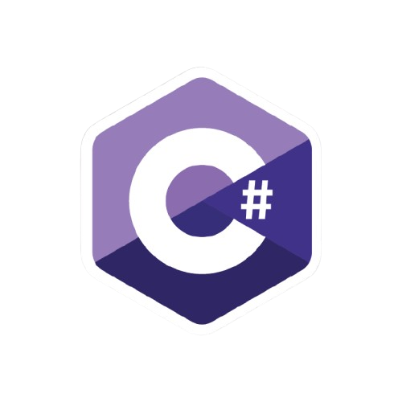

### Hey, Welcome to my profile! 🚀

Hi! I'm Ricardo Castro, a **Full Stack Web Developer** currently studying Software Engineering at UCSal. I'm constantly coding and excited about building innovative solutions.
### Git Infos :computer:

### My Skills :hammer_and_wrench:
Here’s a quick look at the languages and technologies I’m working with:
|C#|Java|JavaScript|Git|React|SQL|
|--|--|--|--|--|--|
 |  |  |  |  |  |

### Get My Resume Here📝 
[📄 Click here to download](https://github.com/Rickccastro/Rickccastro/raw/main/Resume.pdf)

### Connect with Me 📫

  
  
  
  

